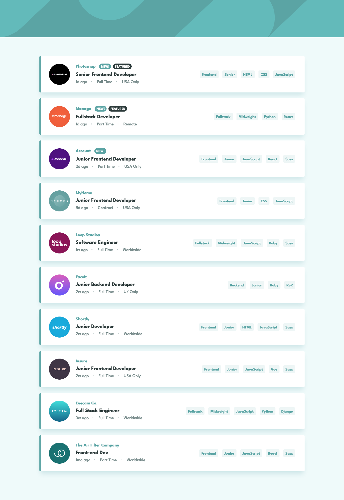

# Job listings with filtering solution

This is a solution to the [Job listings with filtering challenge on Frontend Mentor](https://www.frontendmentor.io/challenges/job-listings-with-filtering-ivstIPCt). Frontend Mentor challenges help you improve your coding skills by building realistic projects.

## About the Project

This project focuses on creating an intuitive job listing interface where users can filter job listings based on various criteria, providing a practical example of state management and dynamic UI updates in a React application.

## Preview and Links

<b>Open / Close Preview</b>

 

 

| [Live Demo URL](https://ionstici.github.io/job-listings-with-filtering) | [Frontend Mentor](https://www.frontendmentor.io/solutions/job-listings-with-filtering-IEMYrLnPZE) |
| ----------------------------------------------------------------------- | ------------------------------------------------------------------------------------------------- |

## Features

-   **Dynamic Filtering:** Users can filter job listings by roles, levels, languages, and tools through interactive tags.
-   **State Management:** Redux manages the application state, ensuring smooth updates when filters are applied or removed.
-   **Responsive Design:** The interface adapts to different screen sizes for a consistent user experience.

## Tech Stack

-   `React`: Core framework for building the UI components, using `create-react-app` for setup.
-   `Redux`: For managing the application's state, particularly for the filtering logic.
-   `Sass`: For CSS styling, ensuring organized and reusable styles.

## Deployment

This project is hosted on **GitHub Pages**.
